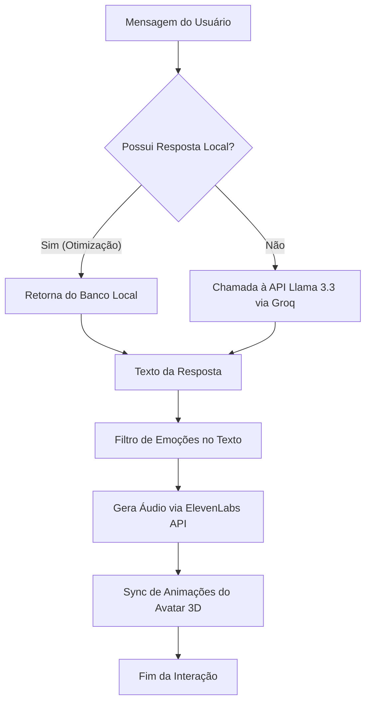

# Relatório Técnico: Agente Glenso 👽

Este relatório apresenta de forma estruturada e abrangente o funcionamento, arquitetura e tecnologias integradas no desenvolvimento do **Agente Glenso**, um assistente virtual interativo em 3D que combina inteligência artificial avançada com síntese e reconhecimento de voz de última geração.

---

## 🛠️ Stack de Tecnologias

O assistente foi desenvolvido com ferramentas modernas para garantir alta performance, renderização fluida e respostas em tempo real:

1. **Framework Principal**: [Next.js 15](https://nextjs.org/) (React) no modo Client-Side Rendering (`'use client'`) para fornecer um Single Page Application (SPA) reativo e dinâmico.
2. **Motor Gráfico 3D**:
   - [Three.js](https://threejs.org/) para a lógica matemática, criação de geometrias customizadas e vetores tridimensionais.
   - [React Three Fiber (R3F)](https://docs.pmnd.rs/react-three-fiber) para integrar o Three.js declarativamente na árvore de componentes do React.
3. **Modelos de Linguagem (LLM)**: Integração via Backend com os modelos da **Meta (Llama 3.3)** executados na infraestrutura de alta velocidade da **Groq Cloud API**.
4. **Síntese de Voz (TTS - Text-to-Speech)**: Integração com a API da **ElevenLabs**, fornecendo modelos neurais de voz hiper-realistas de alta fidelidade (Bella, Antoni e Arnold).
5. **Reconhecimento de Voz (STT - Speech-to-Text)**: Implementado através da **Web Speech API** nativa dos navegadores (`window.webkitSpeechRecognition`), configurada especificamente para o português brasileiro (`pt-BR`).
6. **Interface e Estilização**: **TailwindCSS** e **Vanilla CSS (efeitos de Glassmorphism)** para criar painéis translúcidos de vidro fosco (`backdrop-blur-3xl`), animações de pulso de microfone e transições de painéis.

---

## 📂 Estrutura do Sistema e Componentes

### 1. `app/page.tsx` (Núcleo da Aplicação)
Gerencia o estado global do aplicativo, as interações do usuário e o fluxo de dados.
- **Gerenciamento de Estados**:
  - `isSpeaking`: Indica se o assistente está falando.
  - `isLaughing`: Dispara o comportamento e animação de riso.
  - `isSmiling`: Ativa a expressão facial de sorriso/empatia.
  - `isListening`: Ativa o reconhecimento de áudio pelo microfone.
  - `tone` (Amigável, Formal, Divertido) e `isAlienMode` (Modo Alienígena 👽 / Humano 👤).
- **Recuperação e Persistência**: Salva automaticamente as preferências no `localStorage` do navegador para manter o nome personalizado, modo de voz, mudo e tema ao recarregar a página.

### 2. `components/Avatar.tsx` (Renderização 3D e Animações)
Contém o modelo tridimensional interativo renderizado dinamicamente dentro de um elemento `<Canvas>`.
- **Geometrias Matemáticas Dinâmicas**:
  - **Cabeça em Formato de Gota (Teardrop Head)**: Desenvolvida por meio de curvas Bézier e arcos absolutos via `THREE.Shape`.
  - **Olho Amendoado (Almond Eye)**: Geometria de olhos em formato oval refinado por curvas quadráticas.
  - **Cílios Perfeitamente Espelhados**: Implementados através de cálculos matemáticos trigonométricos para posicionar e rotacionar as pálpebras esquerda e direita em posições simétricas.
- **Animações Executadas no Loop de Renderização (`useFrame`)**:
  - **Seguimento com o Olhar (Mouse-tracking)**: A cabeça ou o corpo rotacionam de forma sutil seguindo a posição bidimensional do cursor do mouse do usuário.
  - **Piscada Dinâmica (Blink Cycle)**: Temporizador estocástico que faz o avatar piscar os olhos e achatar os cílios a cada 2 a 5 segundos de forma natural.
  - **Expressões Faciais**: Interpolação matemática linear (`MathUtils.lerp`) aplicada para suavizar a transição do diâmetro da boca durante a fala (`isSpeaking`), sorriso (`isSmiling`) ou riso (`isLaughing`).

---

## 🔄 Fluxo de Processamento de Mensagens

A arquitetura de resposta é dividida em camadas para otimizar tempo de resposta e consumo de tokens:

1. **Entrada de Texto**: O usuário digita no input ou fala através do botão do microfone (Web Speech API).
2. **Filtro de Resposta Local (Cache Inteligente)**: O sistema analisa o texto (removendo acentos e pontuação). Caso a pergunta combine com o banco local em `data/knowledge.ts` (ex: perguntas sobre o Doutor Antônio Carlos Antolini Junior, missões dele ou dados de DNA), a resposta é entregue instantaneamente, poupando a chamada externa de IA.
3. **Processamento Cognitivo (Llama 3.3)**: Caso contrário, o sistema faz uma requisição para a rota `/api/chat`, que alimenta a IA com o histórico das últimas 5 conversas e um **Prompt do Sistema Dinâmico** adaptado à personalidade (Formal/Divertido/Amigável).
4. **Camada de Expressão (TTS & Emoções)**:
   - A resposta de texto passa por uma análise de gatilhos cômicos (ex: "kkk", "haha", "😂").
   - O áudio é sintetizado via ElevenLabs.
   - **Timing de Riso**: Se o riso estiver no início do texto, o avatar ri imediatamente durante a fala. Se estiver no final (uma piada de efeito), ele ri ao término do áudio por 2.5 segundos.

---

## 🎭 Easter Eggs e Funcionalidades Especiais

- **Rir ao Clicar 5 Vezes**:
  Ao clicar rapidamente **5 vezes seguidas na tela** (dentro do contêiner 3D) com menos de 2 segundos de intervalo, o Agente Glenso dispara imediatamente sua animação de risada por 3 segundos! Essa funcionalidade utiliza `useRef` para rastrear os cliques de forma assíncrona, não impactando a performance gráfica.
- **Modo Alienígena (`isAlienMode`)**:
  Altera a aparência física do avatar para uma criatura alienígena verde limão com proporções físicas diferenciadas, desativando a flutuação corporal padrão para dar um comportamento extraterrestre estático focado no olhar.
- **Modo Formal (Juridiquês)**:
  Quando ativado, altera dinamicamente o vocabulário do assistente para utilizar termos jurídicos e conectivos arcaicos da língua portuguesa (como *outrossim*, *destarte*, *conquanto*), mudando a expressividade da voz.
